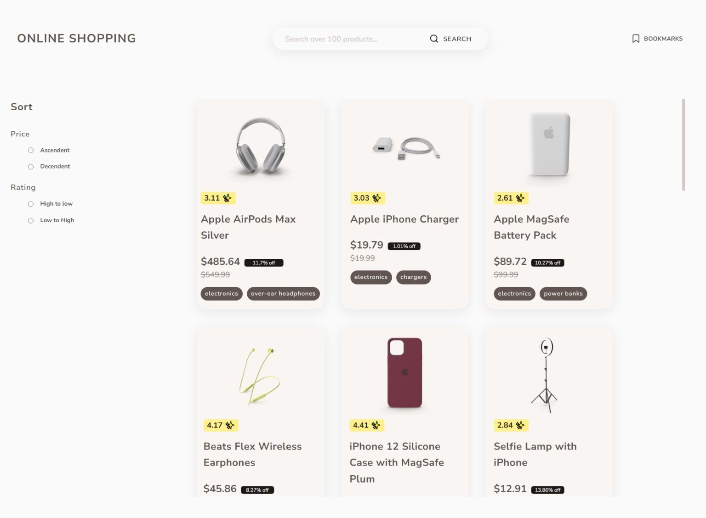

# E-commmerce App

## Table of contents

- [E-commmerce App](#e-commmerce-app)
  - [Table of contents](#table-of-contents)
  - [Overview](#overview)
    - [Built with](#built-with)
    - [Description](#description)
  - [Author](#author)

## Overview

### Built with

- Semantic HTML5 markup
- Scss preprocessor
- Flexbox
- Grid
- Desktop-first workflow
- vanilla javascript
- MVC design pattern

### Description

This e-commerce App is built with vanilla JavaScript to practice and enhance my JavaScript and MVC design pattern skills, also let me get more familiar with Scss preprocessor.

## Author

- [Steven Huang](https://github.com/stevenHuang0604)
